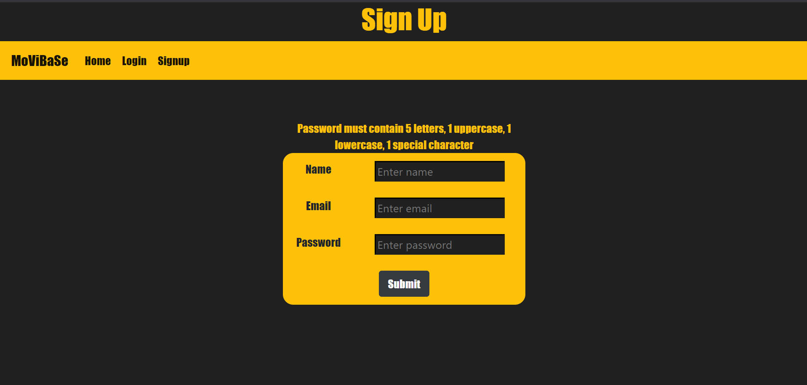
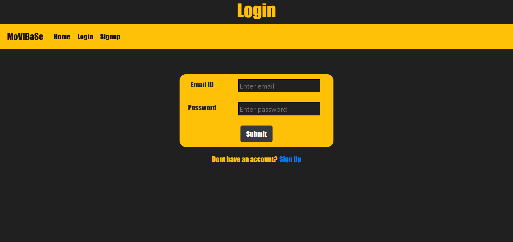
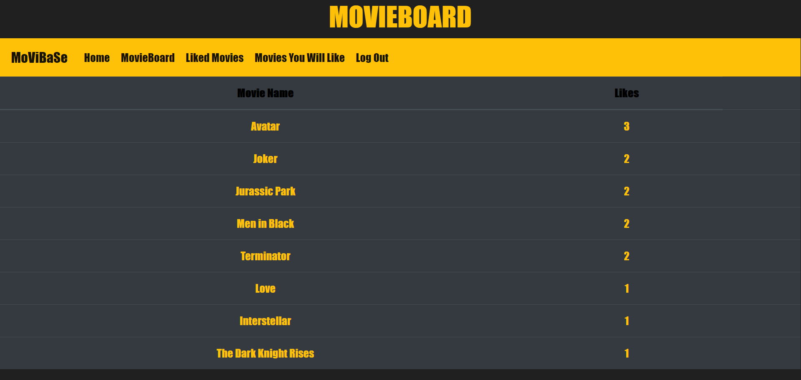
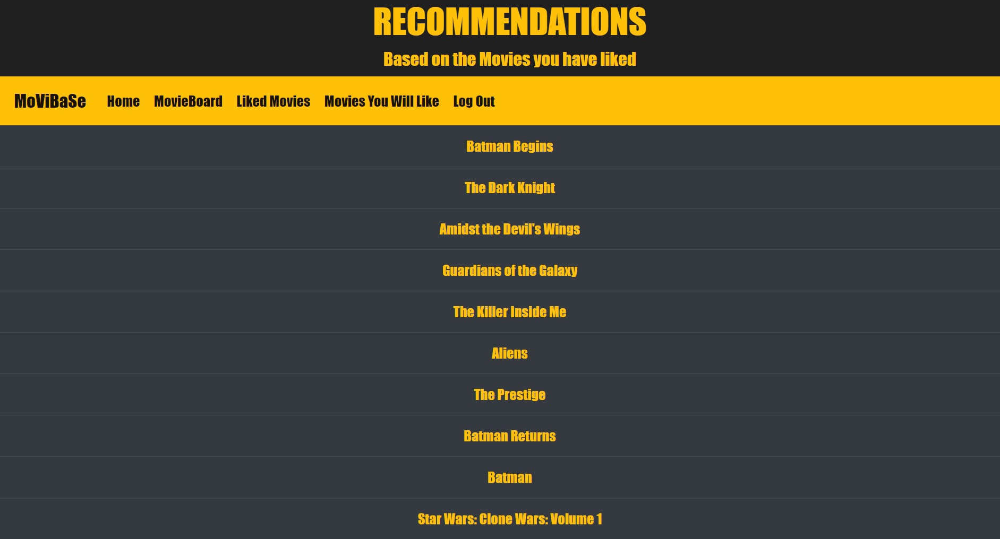

# MovieBase
A website which makes use of the **OMDB API** to fetch details and displays them on the page. Users can search for movies and read details about these movies. Users can also like movies. The website has a **MovieBoard** where one can view the most liked movies by all users. The website also comprises of a **Machine Learning Recommendation Engine** which provides the user with content-based recommendations based on the movies that the user has liked.  

## :clapper: MovieBase Website
- Used `PostgreSQL database` to store login credentials and movies that user likes

- Used a `third-party API` by OMDB that fetches details regarding movies

- Built a `Content based Recommendation Engine` which uses the `IMDB 5000 dataset` from Kaggle to provide recommendations 


## Snapshots
| Home | Sign up |
:-------------------------:|:-------------------------:
 | 
| Homepage | Users can sign up |

| Login | Search & Like  |
:-------------------------:|:-------------------------:
 | 
|  Users can login using their credentials | Can search and like movies |

| Liked Movies | MovieBoard  |
:-------------------------:|:-------------------------:
 | 
| View liked movies by a user | View the most liked movies by all users |

| Recommendations | More info
:-------------------------:|:-------------------------:
 | 
| Movie recommendations based on liked movies | Clicking the movie names will display more info on the movie |


## Getting Started
These instructions will get you a copy of the project up and running on your local machine. 
### Installing
#### Flask
How to setup Flask: https://www.youtube.com/watch?v=QjtW-wnXlUY
#### Postgres
How to install postgreSQL: https://www.youtube.com/watch?v=e1MwsT5FJRQ
#### Numpy
```pip install numpy```
#### Pandas
```pip install pandas```
#### sklearn
```pip install sklearn```


### DB Creation
To create database:
```
1)  After installing postgreSQl, open SQL Shell (psql).

2)  Enter your Server(localhost), Database(postgres), Port(5432), Username(postgres) and Password(which you gave earlier while installing).

3)  After this, run all the commands/queries given in the movie.sql file
```
Make changes: In database.ini file, change password = the one which you gave earlier while installing postgreSQL

As a head start, run the queries in the **head_start.sql** file on PSQL shell 

After doing all these, run **python app.py**
